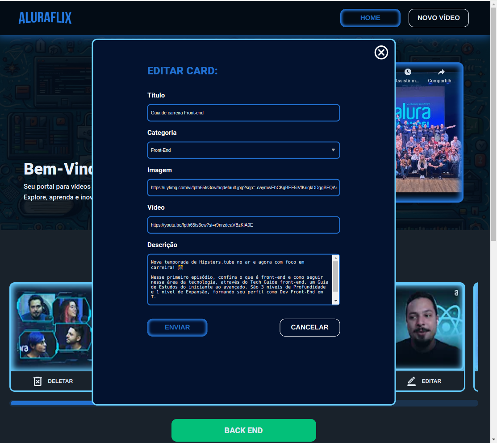

# Descrição do Projeto

Aluraflix é um projeto desenvolvido como parte do último desafio da formação em desenvolvimento frontend do projeto ONE, uma iniciativa da Oracle em parceria com a Alura. Este site tem como objetivo proporcionar uma experiência semelhante ao Netflix, mas focado em vídeos educativos sobre tecnologia e programação oferecidos pela Alura.

### Objetivo

Ser uma plataforma educativa intuitiva e acessível, oferecendo um vasto acervo de vídeos da Alura para fomentar o aprendizado contínuo em tecnologia e programação.

## Funcionalidades

- **Catálogo de Vídeos**: Acesse e assista a vídeos educativos sobre diversos temas de tecnologia e programação diretamente pelo site.

- **Gerenciamento de Conteúdo**: Adicione novas categorias e vídeos para personalizar ainda mais o seu aprendizado.

### Tecnologias Utilizadas

- **HTML**
- **CSS**
- **JavaScript**
- **React.js**

      

## Instruções de uso

Ao abrir a aplicação pela primeira vez, seu catálogo estará vazio

Clique no botão "NOVO VÍDEO" no cabeçalho da página ou em "ADICIONAR", e você será encaminhado à página de cadastro de vídeo: 

Faça o cadastro e envie o vídeo; Se Estiver tudo certo, a seguinte mensagem de sucesso vai aparecer:

Vá até a homepage e seu vídeo estará listado!

Caso queira editar alguma informação do card, clique em "EDITAR" no próprio card e o modal de edição abrirá:

[def]: #índice
